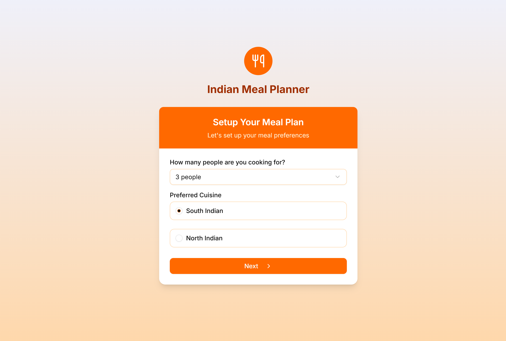
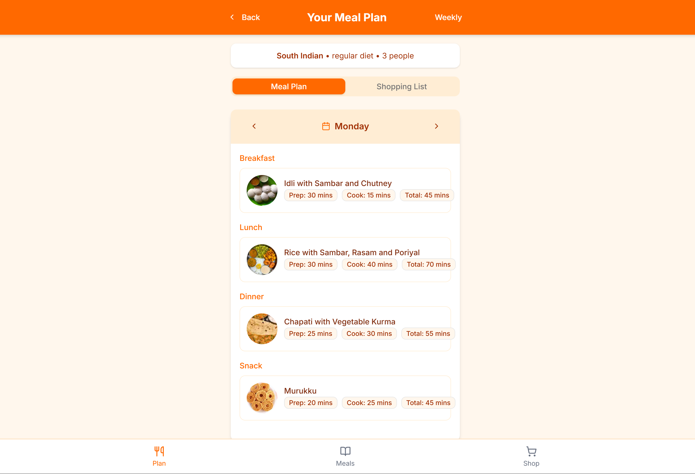
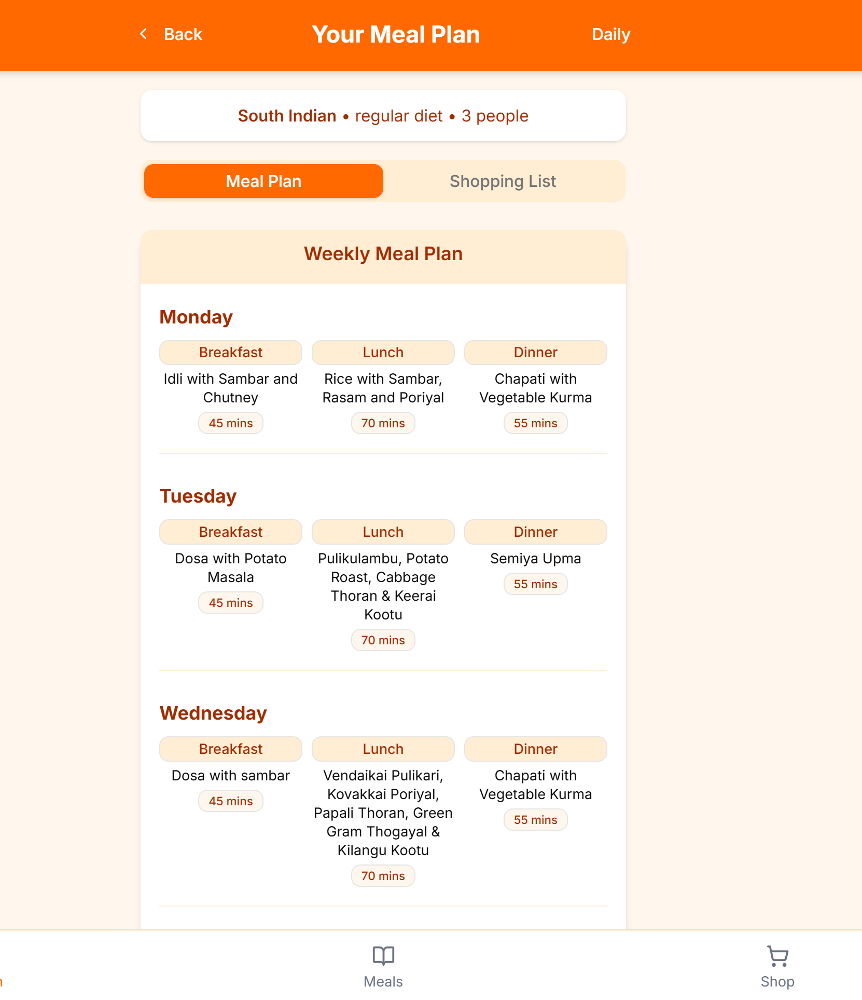

# Indian Meal Planner

[](https://github.com/anburocky3/meal-planner)
[](https://github.com/anburocky3/meal-planner)
[](https://github.com/anburocky3/meal-planner)

[](https://discord.gg/6ktMR65YMy)
[](https://www.youtube.com/c/cyberdudenetworks)

Indian Meal Planner is a comprehensive web application that helps users plan, prepare, and shop for delicious South and North Indian meals. The app generates personalized meal plans based on user preferences, provides detailed recipes, and creates shopping lists for ingredients.


## ✨ Features

- **Personalized Meal Planning**

  - Select cuisine type (South Indian or North Indian)
  - Choose diet type (Regular, Vegetarian, or Vegan)
  - Specify family size and dietary restrictions
  - Get weekly meal plans with breakfast, lunch, dinner, and snacks

- **Detailed Recipe Information**

  - High-quality images of each dish
  - Preparation and cooking times
  - Step-by-step cooking instructions
  - Ingredient lists with quantities

- **Meal Catalog**

  - Browse all available meals
  - Filter by cuisine, diet type, and meal category
  - View detailed recipes and cooking instructions

- **Shopping Experience**

  - Automatically generated shopping lists based on meal plan
  - Check off items as you shop
  - WhatsApp sharing functionality for shopping lists
  - Ingredient quantities optimized for family size

- **Customization Options**

  - Dark mode / light mode toggle
  - Save preferences for future meal plans
  - Update dietary preferences anytime

- **Responsive Design**

  - Works on mobile, tablet, and desktop devices
  - Optimized for all screen sizes
  - Bottom navigation for easy mobile use

- **SEO and Sharing**
  - SEO-optimized pages with proper metadata
  - Open Graph and Twitter Card support for sharing
  - Structured data for recipes and breadcrumbs

## 🚀 Getting Started

### Prerequisites

- Node.js 18.0.0 or later
- npm or yarn

### Installation

1. [Clone](https://github.com/anburocky3/meal-planner/fork) the repository

   ```bash
   git clone https://github.com/anburocky3/meal-planner.git
   cd meal-planner
   ```

2. Install dependencies

   ```bash
   npm install
   # or
   yarn install
   ```

3. Run the development server

   ```bash
   npm run dev
   # or
   yarn dev
   ```

4. Open [http://localhost:3000](http://localhost:3000) in your browser

### Building for Production

```bash
npm run build
# or
yarn build
```

To start the production server:

```bash
npm run start
# or
yarn start
```

## 📚 Project Structure

```
meal-planner/
├── public/                # Static assets and images
├── src/
│   ├── app/               # App router pages
│   │   ├── meal-plan/     # Meal planning interface
│   │   ├── meals/         # Meal catalog and recipes
│   │   ├── settings/      # User preferences
│   │   ├── shop/          # Shopping list
│   │   └── page.tsx       # Home/landing page
│   ├── components/        # Reusable components
│   │   ├── seo/           # SEO-related components
│   │   ├── ui/            # UI components (shadcn/ui)
│   │   └── bottom-navigation.tsx # Mobile navigation
│   ├── data/              # Data models and sources
│   │   ├── ingredients.ts # Ingredient data
│   │   └── meals.ts       # Meal catalog data
│   └── lib/              # Utility functions and helpers
└── tailwind.config.js    # Tailwind CSS configuration
```

## 📸 Screenshots

### Home Screen


_The initial setup screen where users select their preferences_

### Meal Plan


_Weekly meal plan with breakfast, lunch, and dinner options_

### Meal Details


_Detailed view of a meal with ingredients and cooking instructions_

## 🛠️ Built With

- [Next.js](https://nextjs.org/) - React framework
- [TypeScript](https://www.typescriptlang.org/) - Type safety
- [Tailwind CSS](https://tailwindcss.com/) - Styling
- [Shadcn UI](https://ui.shadcn.com/) - UI components
- [Lucide React](https://lucide.dev/) - Icons
- [Radix UI](https://www.radix-ui.com/) - Accessible UI primitives

## 🤝 Contributing

Contributions are welcome! Here's how you can contribute:

1. Fork the repository
2. Create a new branch (`git checkout -b feature/amazing-feature`)
3. Make your changes
4. Commit your changes (`git commit -m 'Add some amazing feature'`)
5. Push to the branch (`git push origin feature/amazing-feature`)
6. Open a Pull Request

Please make sure to update tests as appropriate and adhere to the existing coding style.

### Development Guidelines

- Follow the existing file and folder structure
- Use TypeScript for type safety
- Style components using Tailwind CSS
- Make sure all pages are responsive
- Add appropriate metadata and SEO attributes
- Write clean, maintainable code with appropriate comments

## Author

- [Anbuselvan Annamalai](https://anbuselvan-annamalai.com)

## 📝 License

This project is licensed under the MIT License - see the [LICENSE](LICENSE) file for details.

## 🙏 Acknowledgements

- [Unsplash](https://unsplash.com/) for the meal and food images
- [Radix UI](https://www.radix-ui.com/) for accessible UI primitives
- [Shadcn UI](https://ui.shadcn.com/) for the beautiful component library
- [Lucide React](https://lucide.dev/) for the icon set
- [Vercel](https://vercel.com/) for hosting

## 📧 Contact

If you have any questions or suggestions, please open an issue on this repository or contact the maintainer.
